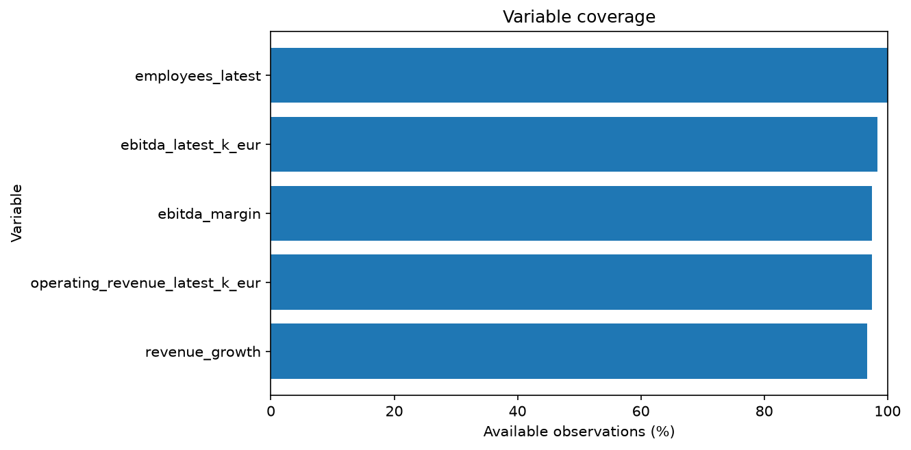
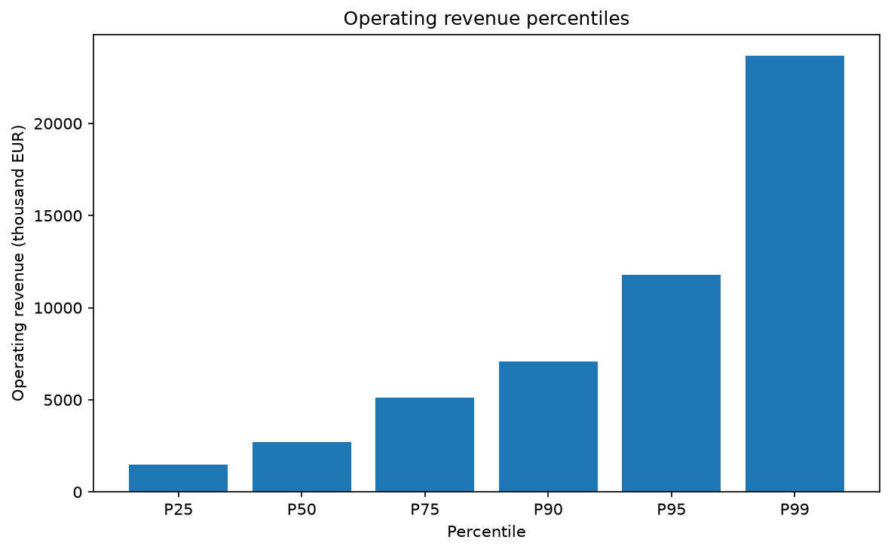
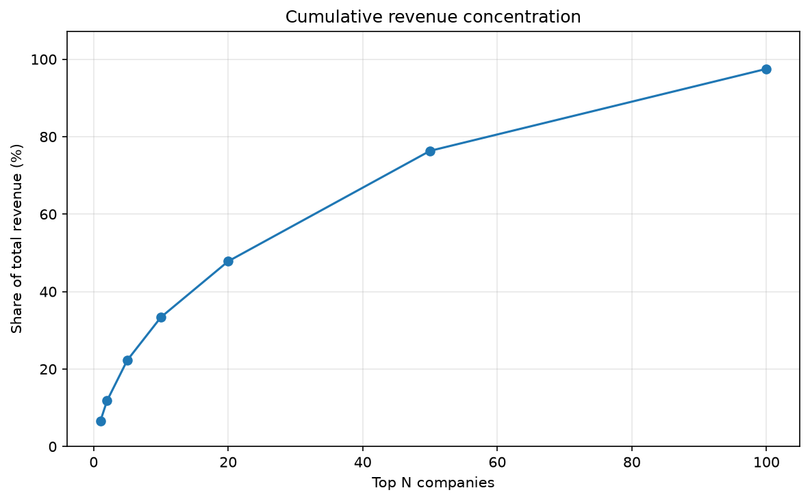
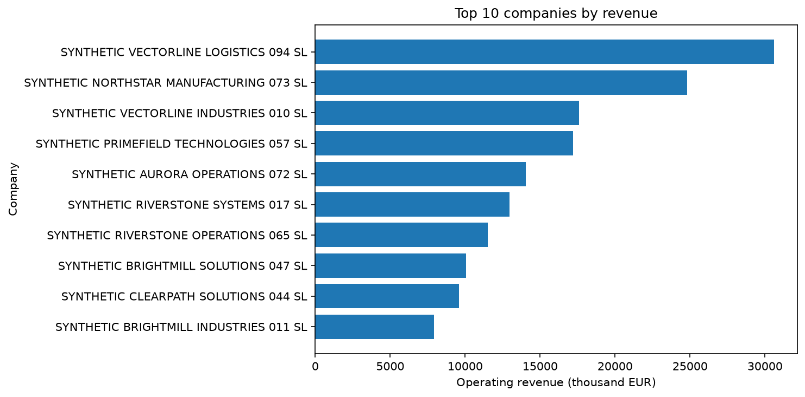
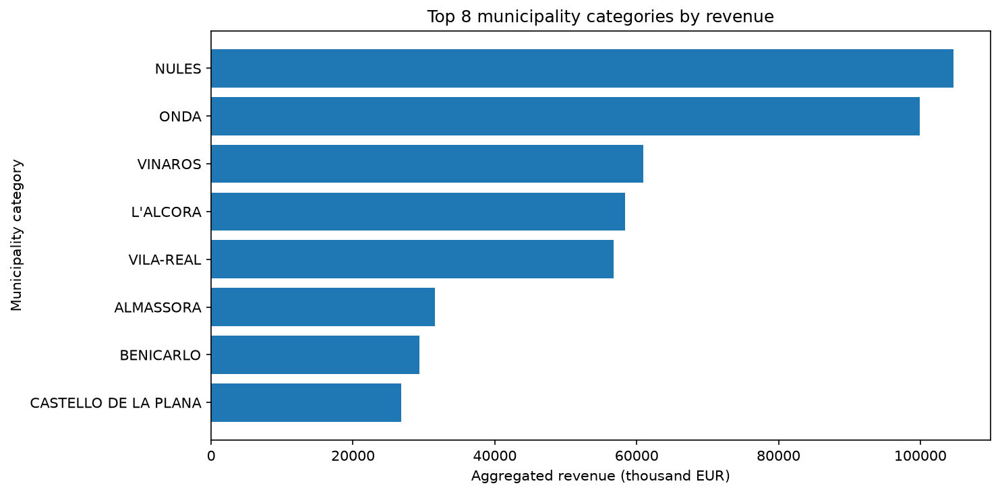

# CapexQuant SABI Castellón

**A tested and reproducible financial-data pipeline for heterogeneous company information.**

CapexQuant validates, cleans and analyses company-level financial data while preserving data lineage, distinguishing data-quality issues from business-risk signals, and preventing the redistribution of licensed SABI records.

The repository includes a fully synthetic public dataset, so the complete public workflow can be executed without access to the private workbook.

## Why this project exists

Corporate datasets frequently combine missing values, heterogeneous reporting periods, legal-status markers, possible duplicate records and highly concentrated financial distributions. CapexQuant addresses these issues through an auditable pipeline rather than a single exploratory notebook.

The project demonstrates how to:

- validate a strict and reusable source schema;
- clean company names and shareholder information deterministically;
- derive revenue growth, EBITDA margin and productivity metrics safely;
- preserve missing values instead of treating missing information as zero;
- separate data-quality issues from economically adverse signals;
- compare documented analytical scopes;
- measure revenue concentration and distribution percentiles;
- create auditable municipality mappings;
- export reproducible tables, metadata, checksums and figures;
- run the public analysis from a deterministic synthetic source;
- validate the implementation through 315 automated tests.

## Public quick start

### 1. Clone the repository

```bash
git clone https://github.com/markusx5622/capexquant-sabi-castellon.git
cd capexquant-sabi-castellon
```

### 2. Create and activate an environment

```bash
python -m venv .venv
```

Windows PowerShell:

```powershell
.\.venv\Scripts\Activate.ps1
```

macOS or Linux:

```bash
source .venv/bin/activate
```

### 3. Install dependencies

```bash
python -m pip install -r requirements.txt
```

### 4. Run the public pipeline

```bash
python -m src.pipeline --source synthetic
```

Expected public execution:

```text
Source: synthetic
Rows processed: 120
Final company-level columns: 36
Analytical tables created: 7
```

### 5. Run the tests

```bash
python -m pytest -m "not private_data" -v
```

To run the complete private suite when the licensed SABI workbook is available:

```bash
python -m pytest -v
```

The current local suite contains **315 passing tests**.

## Public analytical notebook

The executed public notebook is available at:

[`notebooks/01_capexquant_analysis.ipynb`](notebooks/01_capexquant_analysis.ipynb)

The notebook:

- uses only `source="synthetic"`;
- processes 120 fictional companies;
- imports the tested pipeline instead of reimplementing formulas;
- displays coverage, quality, scope, concentration, ranking and geographic outputs;
- contains no private SABI records, real company names or personal information.

## Pipeline architecture

```text
Synthetic CSV or private SABI workbook
                  |
                  v
           Unified source adapter
                  |
                  v
          Standard 10-column schema
                  |
                  v
          Deterministic cleaning
                  |
                  v
       Financial feature engineering
                  |
                  v
      Data-quality and risk controls
                  |
                  v
        Analytical aggregation
                  |
                  v
      Tables, metadata and figures
```

Company-level dimensions are preserved across the workflow:

| Layer | Columns | Purpose |
|---|---:|---|
| Source | 10 | Common public and private input contract |
| Clean | 16 | Name, legal-status and duplicate traceability |
| Financial | 28 | Financial metrics and preventive flags |
| Quality | 36 | Quality, risk, reasons and eligibility |

The pipeline validates both row-count integrity and `record_order` preservation.

## Main modules

| Module | Responsibility |
|---|---|
| `src/load_data.py` | Loads and validates the private SABI workbook |
| `src/generate_synthetic_data.py` | Generates the deterministic public dataset and metadata |
| `src/data_sources.py` | Provides a unified `synthetic` and `sabi` source interface |
| `src/clean_data.py` | Cleans text, derives legal markers and flags potential duplicates |
| `src/financial_features.py` | Calculates financial metrics using safe division |
| `src/quality_control.py` | Separates data-quality issues from business-risk signals |
| `src/geography.py` | Supports auditable municipality normalization |
| `src/analytics.py` | Produces coverage, scopes, percentiles, concentration and rankings |
| `src/pipeline.py` | Orchestrates the complete source-to-analysis workflow |
| `src/export_results.py` | Exports tables, metadata and checksum manifests |
| `src/visualization.py` | Generates reproducible public figures |

## Analytical outputs

The standard pipeline creates seven tables:

1. `scope_comparison`
2. `coverage`
3. `quality_summary`
4. `revenue_concentration`
5. `revenue_percentiles`
6. `company_ranking`
7. `municipality_summary`

Public exports are generated from synthetic data. Private company-level outputs remain outside version control.

## Public visual outputs

### Variable coverage



### Revenue percentiles



### Revenue concentration



### Synthetic company ranking



### Municipality summary



All public ranking labels identify fictional companies with the `SYNTHETIC` prefix.

## Methodological principles

### Missing information is not zero

Unavailable financial values remain missing. This prevents artificial distortion of totals, ratios, growth and productivity measures.

### Safe financial calculations

Ratios are calculated only when the required numerator and denominator are available and the denominator is valid. Invalid divisions produce missing values rather than infinite values or artificial zeros.

### Data quality is not business performance

CapexQuant treats the following as distinct concepts:

- **Data-quality issue:** incomplete information, negative or zero revenue, extreme EBITDA margin, or a potential duplicate.
- **Business-risk signal:** adverse legal-status marker, negative EBITDA, or declining revenue.

A company may contain reliable data while presenting weak financial performance.

### Explicit analytical scopes

- `all`
- `no_adverse_marker`
- `eligible`
- `no_adverse_eligible`

Filters are explicit and documented. Records are not silently deleted.

### Auditable geography

The project preserves the original municipality label, creates a conservative matching key and stores canonical decisions in:

[`data/reference/municipality_mapping.csv`](data/reference/municipality_mapping.csv)

## Private SABI analysis

The licensed local extraction contains:

- 6,711 company records;
- 164,781 employees;
- approximately EUR 42.7 billion in aggregated revenue;
- approximately EUR 2.6 billion in aggregated EBITDA;
- approximately 56.3% of revenue concentrated in the 100 largest companies.

These figures combine each company's latest available reporting period. They must not be interpreted as a homogeneous provincial total for one fiscal year.

The private workflow can be executed locally when the licensed workbook is available:

```bash
python -m src.pipeline --source sabi
```

The workbook is intentionally excluded from Git and is not required for the public demonstration.

## Data privacy and licensing

The repository does not redistribute the licensed SABI workbook or private company-level derived datasets.

Publicly versioned data artefacts are limited to:

- a fully synthetic company dataset;
- synthetic metadata and checksum information;
- an auditable municipality reference mapping;
- synthetic tables and figures;
- aggregate methodological documentation.

The synthetic dataset explicitly declares:

```text
contains_sabi_data: false
contains_real_companies: false
contains_personal_data: false
```

See [`data/README.md`](data/README.md) for the data-use policy.

## Technology stack

- **Python**: core pipeline and command-line execution
- **Pandas**: tabular transformation, validation and aggregation
- **NumPy**: deterministic simulation and numerical operations
- **Matplotlib**: reproducible financial visualizations
- **Pytest**: unit, integration and regression testing
- **Jupyter**: executed public analytical notebook
- **JSON and CSV**: portable metadata and analytical exports
- **SHA-256**: reproducibility and file-integrity verification
- **Git and GitHub**: version control and public project distribution
- **GitHub Actions**: automated public testing and synthetic pipeline validation on Python 3.12

## Technical documentation

- [Architecture](docs/architecture.md)
- [Methodology](docs/methodology.md)
- [Data dictionary](docs/data_dictionary.md)
- [Data-quality rules](docs/data_quality_rules.md)
- [Geographic normalization](docs/geographic_normalization.md)
- [Synthetic data](docs/synthetic_data.md)
- [Limitations](docs/limitations.md)

## Repository structure

```text
capexquant-sabi-castellon/
├── data/
│   ├── raw/                  # Private licensed source, ignored by Git
│   ├── processed/            # Private derived data, ignored by Git
│   ├── reference/            # Public geographic mapping
│   ├── sample/               # Public synthetic dataset and metadata
│   └── README.md             # Data-use policy
├── docs/                     # Technical documentation
├── notebooks/                # Executed public analytical notebook
├── reports/
│   ├── figures/              # Reproducible public figures
│   └── tables/               # Reproducible public exports
├── src/                      # Production Python modules
├── tests/                    # Automated tests
├── sql/                      # Reserved for future extensions
├── .gitignore
├── LICENSE
├── README.md
└── requirements.txt
```

## Limitations

- The SABI extraction combines heterogeneous reporting periods.
- EBITDA is not equivalent to operating or free cash flow.
- The current schema does not include complete balance-sheet, debt, cash, CAPEX or cash-flow information.
- Legal status is inferred from explicit wording in the company-name field.
- Potential duplicates are warnings, not confirmed duplicate legal entities.
- The public synthetic sample is not representative of the Castellón economy.
- The public schema does not currently include a validated sector classification.
- Results must not be used as the sole basis for investment, credit or legal decisions.

See [the complete limitations document](docs/limitations.md).

## Project status

The core version includes:

- [x] Private and synthetic source adapters
- [x] Deterministic cleaning
- [x] Financial feature engineering
- [x] Data-quality and business-risk controls
- [x] Auditable geographic normalization
- [x] Analytical tables and rankings
- [x] Reproducible exports and checksum manifests
- [x] Public visualizations
- [x] Executed public notebook
- [x] Technical documentation
- [x] 315 passing tests
- [x] Public continuous integration workflow
- [ ] Final repository audit and version 1.0 release

## Author

**Marc Cubero Cantavella**

Industrial Organization Engineering student focused on financial analytics, data analysis and quantitative finance.
