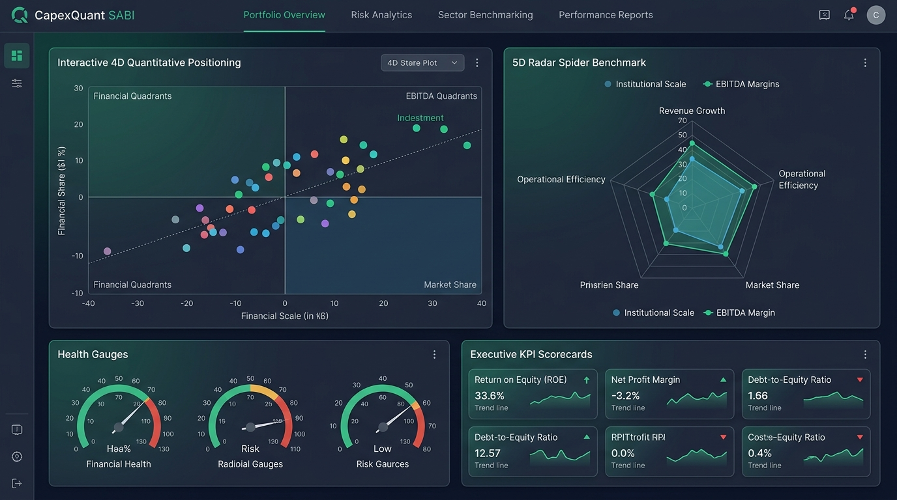
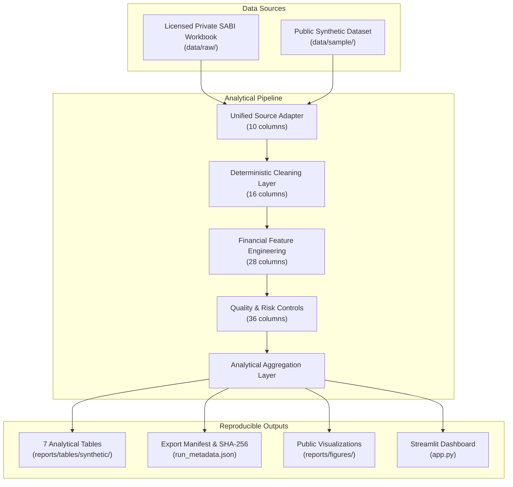

# CapexQuant SABI Castellón

**A reproducible corporate financial analytics pipeline for data quality, financial feature engineering and business screening.**

[](https://github.com/markusx5622/capexquant-sabi-castellon/actions/workflows/tests.yml)
[](https://capexquant.streamlit.app/)
[](https://github.com/markusx5622/capexquant-sabi-castellon/releases)
[](https://www.python.org/)
[](LICENSE)



CapexQuant SABI Castellón is a reproducible corporate financial analytics pipeline that transforms heterogeneous company-level data into a traceable analytical layer through deterministic cleaning, financial feature engineering, data-quality controls, business-risk signals, analytical summaries, rankings, reproducible exports, public visualizations and an interactive Streamlit dashboard.

This repository is designed for corporate finance analysts, data engineers and recruitment evaluators who require rigorous data lineage and reproducible methodologies when working with unstructured or proprietary corporate data. The public repository runs entirely on a deterministic synthetic dataset, ensuring complete reproducibility without redistributing confidential or licensed SABI records.

> **Live Interactive Demo:** The Streamlit analytics dashboard is deployed and publicly accessible at **[capexquant.streamlit.app](https://capexquant.streamlit.app/)**.

## Project highlights

- **Deterministic, auditable data pipeline:** Strict schema enforcement and multi-layer column validation with zero row loss and complete order preservation.
- **Corporate financial feature engineering:** Safe division formulas for year-over-year revenue growth, EBITDA margin, and employee productivity metrics without distorted zero imputations.
- **Separation of data-quality issues and business-risk signals:** Clear distinction between data integrity defects and valid economic distress conditions.
- **Reproducible synthetic public dataset:** 120 fictional company records generated from a fixed random seed with verified SHA-256 checksums.
- **Interactive Streamlit analytics dashboard:** Eight dedicated analytical views, dynamic filters, KPI scorecards and instant CSV/JSON exports. Available live at [capexquant.streamlit.app](https://capexquant.streamlit.app/).
- **Automated tests and GitHub Actions:** Comprehensive test suite with 162 public tests executed in Python 3.12 CI, alongside export manifests and standalone figures.

## Public demonstration

All public demonstration results, charts and dashboard views are generated exclusively from a fully synthetic dataset of 120 fictional companies using a fixed random seed (`20260820`) and verified SHA-256 checksums.


The concentration chart above illustrates the cumulative distribution of revenue across top-ranked companies within the synthetic dataset, highlighting structural skewness without exposing licensed private records.

### Additional public figures


## Business problem

Raw corporate financial datasets extracted from business registers frequently exhibit data defects and structural limitations, including:

- Missing financial observations across reporting years
- Inconsistent or noisy legal-status labels in company names
- Extreme heterogeneity in company sizes and financial scales
- Severe accounting outliers and extreme margin ratios
- Non-standardized geographic names and bilingual municipality variants
- Potential duplicate or successor entities
- Incomplete or placeholder shareholder information
- Non-comparable, asynchronous reporting periods

CapexQuant converts these real-world data challenges into explicit, traceable controls and documented analytical scopes rather than silently imputing missing fields or discarding anomalous observations without audit trails.

## Architecture

The pipeline processes data through a strictly typed, unidirectional architectural sequence. Both the licensed private SABI workbook and the public synthetic dataset converge into the exact same analytical transformations.



### Layer progression

1. **Source layer (10 columns):** Standardized schema enforcing unique `record_order`, company names, municipality, employment, revenue, EBITDA and shareholder fields.
2. **Clean layer (16 columns):** Adds normalized matching keys, text cleanup, explicit duplicate warnings and parsed legal-status categories (`extinct`, `in_liquidation`, `in_dissolution`, `no_adverse_marker`).
3. **Financial layer (28 columns):** Derives growth, margins, productivity ratios and boolean financial indicators using safe division.
4. **Quality-controlled layer (36 columns):** Combines active quality and risk flags into issue counts, status labels (`clean`, `review`, `high_priority_review`), analytical eligibility categories and traceable reason strings.

Row order and row count are strictly preserved across all transformations, and analytical outputs are generated from defensive copies.

## Analytical outputs

The standard execution produces seven structured analytical tables:

1. `scope_comparison.csv`: Comparative summary of company counts, aggregate revenues, and median metrics across all four analytical scopes.
2. `coverage.csv`: Field-level completeness counts and percentage coverage rates.
3. `quality_summary.csv`: Frequencies and percentages for every data-quality and business-risk indicator.
4. `revenue_concentration.csv`: Cumulative revenue amounts and concentration ratios for standard Top-N tiers (Top 1, 2, 5, 10, 20, 50, 100).
5. `revenue_percentiles.csv`: Revenue distribution breakdown across standard quantiles (P25, P50, P75, P90, P95, P99).
6. `company_ranking.csv`: Sorted leaderboards of top companies by operating revenue.
7. `municipality_summary.csv`: Aggregated entity counts, employment, total revenue, EBITDA and adverse-status rates by municipality.

The export module also outputs:

- `companies_quality_controlled.csv`: Full company-level analytical dataset with all 36 validated columns.
- `run_metadata.json`: Execution environment parameters, row counts and timestamp metadata.
- `export_manifest.json`: Cryptographic SHA-256 checksums and file sizes for every exported artifact.

## Financial methodology

Financial calculations follow strict corporate finance standards:

### Core formulas

- **Revenue growth (year-over-year):**
  ```text
  revenue_growth = (revenue_latest - revenue_previous) / revenue_previous
  ```
  Evaluated only when both periods exist and `revenue_previous > 0`.

- **EBITDA margin:**
  ```text
  ebitda_margin = ebitda_latest / revenue_latest
  ```
  Evaluated only when both fields exist and `revenue_latest > 0`.

- **Revenue per employee:**
  ```text
  revenue_per_employee_k_eur = revenue_latest / employees_latest
  ```
  Evaluated only when `employees_latest > 0`.

- **EBITDA per employee:**
  ```text
  ebitda_per_employee_k_eur = ebitda_latest / employees_latest
  ```
  Evaluated only when `employees_latest > 0`.

### Methodological rules

- **Units:** Monetary values are denominated in thousands of euros (`k_eur`).
- **Ratio storage:** Ratios and margins are stored as decimals (e.g. `0.15` for 15%), not percentage integers.
- **Safe division:** Zero or missing denominators strictly produce `NaN` rather than `inf`, `-inf` or artificial zeros.
- **No silent imputation:** Missing data is preserved throughout all stages to avoid distorting aggregate metrics and distribution shapes.
- **EBITDA cash-flow distinction:** EBITDA is treated strictly as an accounting operating metric, not as operating or free cash flow.
- **EBITDA sign changes:** Absolute EBITDA differences (`ebitda_change_k_eur`) are calculated alongside margins because percentage growth across sign changes is mathematically distorted.

## Data-quality framework

CapexQuant maintains a strict separation between data-quality defects and business-risk indicators:

- **Data-quality issues:** Conditions that compromise record reliability or calculation validity (e.g., incomplete financial reporting, negative operating revenue, zero revenue denominator, extreme EBITDA margins, or potential duplicate entities).
- **Business-risk signals:** Economically adverse operational or legal conditions that represent valid corporate observations rather than data errors (e.g., negative EBITDA, declining revenue, or legal status markers indicating liquidation or extinction).

This distinction ensures that economically distressed or unprofitable companies are not incorrectly classified or discarded as invalid data. For full rule specifications, see [`docs/data_quality_rules.md`](docs/data_quality_rules.md).

## Public and private data

### Public mode

Public execution utilizes the synthetic dataset:

[`data/sample/companies_synthetic.csv`](data/sample/companies_synthetic.csv)

Key properties:
- All company names are prefixed with `SYNTHETIC`
- Websites use the reserved `.example` domain
- Shareholder entities use fictional names (`SYNTHETIC HOLDING XX SL`)
- Dataset generation is deterministic with fixed seed `20260820`
- The dataset is not representative of the Castellón economy
- Public outputs must not be used for investment, credit or commercial decisions

### Private mode

Private mode enables local execution against the licensed SABI workbook when an authorized researcher possesses valid access credentials:

- The raw SABI workbook is excluded from Git via `.gitignore`
- Private derived company-level datasets remain inside local ignored directories (`data/processed/`)
- Real company records and microdata are never committed or published
- The MIT License applies to the software and documentation, not to third-party database content

For detailed data governance, refer to [`data/README.md`](data/README.md), [`docs/synthetic_data.md`](docs/synthetic_data.md), and [`docs/limitations.md`](docs/limitations.md).

## Quick start

### 1. Clone the repository

```bash
git clone https://github.com/markusx5622/capexquant-sabi-castellon.git
cd capexquant-sabi-castellon
```

### 2. Set up virtual environment

```bash
python -m venv .venv
```

Activate on Windows PowerShell:

```powershell
.\.venv\Scripts\Activate.ps1
```

Activate on macOS or Linux:

```bash
source .venv/bin/activate
```

### 3. Install dependencies

```bash
python -m pip install -r requirements.txt
```

### 4. Launch interactive Streamlit dashboard

Launch locally:

```bash
streamlit run app.py
```

Or access the live deployment directly at: **[capexquant.streamlit.app](https://capexquant.streamlit.app/)**

### 5. Generate synthetic dataset

```bash
python -m src.generate_synthetic_data
```

### 6. Run the public pipeline

```bash
python -m src.pipeline --source synthetic
```

### 7. Export analytical results

```bash
python -m src.export_results
```

### 8. Generate public figures

```bash
python -m src.visualization
```

### 9. Run public automated tests

```bash
python -m pytest -m "not private_data" -v
```

## Public analytical notebook

An executed public analysis is provided at:

[`notebooks/01_capexquant_analysis.ipynb`](notebooks/01_capexquant_analysis.ipynb)

The notebook:
- Runs exclusively on `source="synthetic"`
- Imports directly from the modular `src/` codebase without code duplication
- Validates pipeline outputs against integrity assertions
- Contains only synthetic, non-confidential data and visualizations
- Can be re-executed from top to bottom in any standard Python 3.12 environment

## Testing and continuous integration

The test suite enforces full code correctness, edge-case coverage and data-quality validation:

- **162 public tests** executed automatically in CI without requiring private files.
- **164 private tests** deselected during public runs via pytest markers (`-m "not private_data"`).
- **326 total collected tests** across public unit, integration, visualization, dashboard and private data validation suites.
- **Python 3.12 GitHub Actions workflow:** Fully tests pipeline execution, validates table schemas, verifies figures, and asserts the absence of proprietary spreadsheets.

Workflow configuration is maintained in [`.github/workflows/tests.yml`](.github/workflows/tests.yml).

## Repository structure

```text
capexquant-sabi-castellon/
├── .github/workflows/       # GitHub Actions CI workflow (tests.yml)
├── .streamlit/              # Streamlit configuration settings
├── data/
│   ├── reference/           # Auditable municipality reference mapping
│   ├── sample/              # Public synthetic dataset and metadata
│   └── README.md            # Data governance and licensing policy
├── docs/                    # Technical architecture and methodology docs
├── notebooks/               # Executed public analytical notebook
├── reports/
│   ├── figures/             # Reproducible analytical visualizations
│   └── tables/synthetic/    # Exported public analytical tables and manifests
├── src/                     # Modular Python source code and dashboard logic
├── tests/                   # Automated pytest suite and fixtures
├── .gitignore               # Strict exclusion rules for private data and caches
├── app.py                   # Streamlit web application entrypoint
├── LICENSE                  # MIT License
├── pytest.ini               # Pytest markers and configuration
├── README.md                # Main portfolio documentation
└── requirements.txt         # Pinned dependency requirements
```

## Technical documentation

Comprehensive documentation is available in the [`docs/`](docs/) directory:

- [Architecture](docs/architecture.md): System design, layer transitions and module responsibilities
- [Methodology](docs/methodology.md): Mathematical definitions, safe division and scope filtering
- [Data Dictionary](docs/data_dictionary.md): Comprehensive definitions for all 36 pipeline fields
- [Data-Quality Rules](docs/data_quality_rules.md): Classification logic for quality issues vs. business risk
- [Geographic Normalization](docs/geographic_normalization.md): Auditable municipality matching framework
- [Synthetic Data](docs/synthetic_data.md): Deterministic simulation methodology and SHA-256 verification
- [Limitations](docs/limitations.md): Boundary conditions, temporal heterogeneity and usage constraints
- [Data Governance](data/README.md): Licensing boundaries and data privacy policies

## Limitations

- **Synthetic data scope:** Public outputs are derived from synthetic data and do not reflect the actual economy of Castellón.
- **Temporal heterogeneity:** Source data represents each company's latest available filing rather than a single harmonized fiscal year.
- **EBITDA vs. cash flow:** EBITDA does not reflect working capital changes, taxes, interest, debt service or capital expenditures.
- **Credit and solvency limits:** The schema lacks complete balance-sheet debt maturity schedules and cash balances necessary for definitive solvency ratings.
- **Valuation limits:** Revenue and EBITDA figures alone are insufficient for formal equity or business valuation.
- **Geographic mappings:** Municipality text normalization relies on documented matching rules that require human audit.
- **Decision support only:** Outputs are intended for quantitative demonstration and analytical screening, not formal legal, credit or investment advice.

## Project status

- [x] Private and synthetic source adapters
- [x] Deterministic cleaning
- [x] Financial feature engineering
- [x] Data-quality and business-risk controls
- [x] Auditable geographic normalization
- [x] Analytical tables and rankings
- [x] Reproducible exports and checksum manifests
- [x] Public visualizations
- [x] Interactive Streamlit analytics dashboard (`app.py`)
- [x] Executed public notebook
- [x] Technical documentation
- [x] Automated test suite (162 public tests passing)
- [x] Public continuous integration workflow (Python 3.12)
- [x] Final repository audit and release preparation

## License

This project is licensed under the terms of the [MIT License](LICENSE).

- The MIT License applies to all original source code, test suites, documentation and synthetic datasets.
- Proprietary database records, third-party trademarks and licensed SABI content are strictly excluded from redistribution.
- Users must consult [`data/README.md`](data/README.md) before connecting local proprietary extracts.

## Portfolio context

This project demonstrates core competencies in:

- **Production-grade Python development:** Modular architecture, type hinting, immutable dataclasses and strict input contracts.
- **Data engineering & ETL pipelines:** Unidirectional layer progression (`10 -> 16 -> 28 -> 36` columns) with defensive copying and order preservation.
- **Interactive dashboard engineering:** Streamlit web application with multi-view analytics, dynamic filtering and export workflows.
- **Corporate financial analysis:** Rigorous formulation of financial ratios, growth rates and productivity metrics with safe edge-case handling.
- **Data governance and privacy:** Zero-leakage pipeline design combining private local processing with public synthetic reproducibility.
- **Automated testing & CI/CD:** Comprehensive pytest test suite with marker isolation and automated GitHub Actions verification.
- **Clear technical documentation:** Exhaustive architectural specifications, mathematical dictionaries and audit logs.

---

**Author:** Marc Cubero Cantavella
**Focus:** Financial Analytics, Data Engineering and Quantitative Finance
